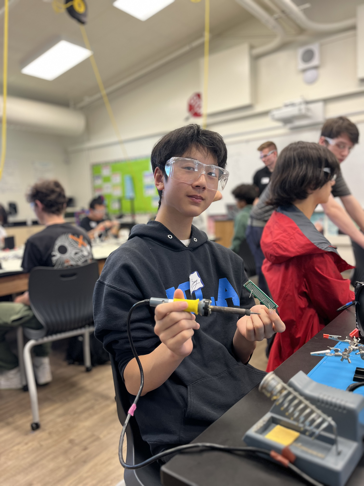

# Ball Tracker Robot
From glowing bugs to AI robots, my journey at BlueStamp has been filled with adversity and opportunity. The Ball Tracker Robot works by detecting a red ball using AI to determine its next course of action


| **Engineer** | **School** | **Area of Interest** | **Grade** |
|:--:|:--:|:--:|:--:|
| Eric S | Lowell HS | Electrical Engineering | Incoming Sophomore

  
  
<!---# Final Milestone

<iframe width="560" height="315" src="https://www.youtube.com/embed/F7M7imOVGug" title="YouTube video player" frameborder="0" allow="accelerometer; autoplay; clipboard-write; encrypted-media; gyroscope; picture-in-picture; web-share" allowfullscreen></iframe>

# Second Milestone

<iframe width="560" height="315" src="https://www.youtube.com/embed/y3VAmNlER5Y(https://www.youtube.com/embed/NTk1sGW9OV4?si=9ZicSQZY8JYFDKma)" title="YouTube video player" frameborder="0" allow="accelerometer; autoplay; clipboard-write; encrypted-media; gyroscope; picture-in-picture; web-share" allowfullscreen></iframe>
--->
# First Milestone
<iframe width="560" height="315" src="https://www.youtube.com/embed/EjweVmvLvAc?si=SrWfulnb5zmT4sY9" title="YouTube video player" frameborder="0" allow="accelerometer; autoplay; clipboard-write; encrypted-media; gyroscope; picture-in-picture; web-share" referrerpolicy="strict-origin-when-cross-origin" allowfullscreen></iframe>
### Summary
For my first milestone, I have decided to finish setting up the hardware required to operate my robot. Essentially, the chassis, or the clear glass with wheels attached, strings together the other parts, allowing the robot to move. The Arduino and Raspberry Pi, both situated on top of the chassis, allow electricity to spread to other parts and receive code. Combined with the HC-SR04 sensors on the front, my robot will eventually be able to detect other objects and move accordingly.
#Materials Used

### Materials Used
Glass Chassis  Wheels (2 front 1 back)
HC-SR04 Sensors + the corresponding glass parts
Raspberry Pi Camera Module
Raspberry Pi Module 4
L298N Motor Driver
Breadboard
Motors x2
Screws, nuts
Female-to-female jumper wires
### Challenges
1. The instructions for installing the glass chassis weren't super clear, especially with the installation of screws. The nuts for the screws wouldn't screw on because the glass chassis was in the way. However, this was solved by simply changing the direction the screws faced. Also, I had absolutely no idea what to do due to the unclear instructions and inaccurate wiring schematics so I had to figure out a lot of things on my own, which took a bit of time. Finally, there were a lot of wires to deal with since each sensor (x3) had a total of four wires, so my robot looked extremely messy.

### What's Next
In the future, I hope to continue my code and tidy up my robot further.


# Starter Project
<iframe width="560" height="315" src="https://www.youtube.com/embed/NTk1sGW9OV4?si=3lOBwtOGQsa74cHu" title="YouTube video player" frameborder="0" allow="accelerometer; autoplay; clipboard-write; encrypted-media; gyroscope; picture-in-picture; web-share" allowfullscreen></iframe>

My starter project is the Weevil Eyes, which is a light-detecting bug that glows depending on the surrounding light. If the environment is dark, then the lights glow up. For this project, there weren't any big challenges due to the lack of coding and complex steps. Essentially, the bug works by sensing the surrounding light with a sensor at the bottom. If there is light, that signal will go towards the transistor, which is like a switch. When there is light, the transistor will make sure that the LEDs do not light up. However, if there isn't light, the transistor will send electricity to the resistors, which resist electricity to ensure that the LEDs are not fried. And as electricity goes through the resistors and towards the LEDs, the LEDs then illuminate.

<!--- # Schematics 

# Code Used

```c++
void setup() {
  // put your setup code here, to run once:
  Serial.begin(9600);
  Serial.println("Hello World!");
}

void loop() {
  // put your main code here, to run repeatedly:

}
```
-->
# Materials Used

| **Part** | **Note** | **Price** | **Link** |
|:--:|:--:|:--:|:--:|
| Basic Connections Component Kit      | Connects parts to other parts                       | $11.99 | [Link](https://www.amazon.com/Smraza-Breadboard-Resistors-Mega2560-Raspberry/dp/B01HRR7EBG/ref=sr_1_16?crid=27G99F3EADUCG&keywords=breadboard+1+pc&qid=1689894556&sprefix=breadboard+1+p%2Caps%2C185&sr=8-16)    |
| Female to Female Jumper Wires        | Used to connect parts to others                 | $7.98  | [Link](https://www.amazon.com/EDGELEC-Breadboard-1pin-1pin-Connector-Multicolored/dp/B07GCY6CH7/ref=sr_1_3?crid=3C4YB6HOGZ8ZQ&keywords=female%2Bto%2Bfemale%2Bjumper&qid=1689894791&s=electronics&sprefix=female%2Bto%2Bfemale%2Bjumper%2Celectronics%2C161&sr=1-3&th=1) |
| HC-SR04 Sensors                       | Allows the robot to see obstacles                | $8.99  | [Link](https://www.amazon.com/Organizer-Ultrasonic-Distance-MEGA2560-ElecRight/dp/B07RGB4W8V/ref=sr_1_2?crid=UYI359LWAAVU&keywords=hc%2Bsr04%2Bultrasonic%2Bsensor%2B3%2Bpc&qid=1689699122&s=electronics&sprefix=hc%2Bsr04%2Bultrasonic%2Bsensor%2B3%2Bpc%2Celectronics%2C123&sr=1-2&th=1) |
| HDMI to Micro HDMI Cable             | Connects pi to the monitor                      | $8.99  | [Link](https://www.amazon.com/UGREEN-Adapter-Ethernet-Compatible-Raspberry/dp/B06WWQ7KLV/ref=sr_1_5?crid=3S06RDX7B1X4O&keywords=hdmi+to+micro+hdmi&qid=1689699482&s=electronics&sprefix=hdmi+to+micro%2Celectronics%2C132&sr=1-5)        |
| L298N Driver Board                   | Drives the wheels forward and backwards          | $8.99  | [Link](https://www.amazon.com/Qunqi-2Packs-Controller-Stepper-Arduino/dp/B01M29YK5U/ref=sr_1_1_sspa?crid=3DE9ZH0NI3KJX&keywords=l298n&qid=1689698859&s=electronics&sprefix=l298n%2Celectronics%2C164&sr=1-1-spons&sp_csd=d2lkZ2V0TmFtZT1zcF9hdGY&psc=1)           |
| Motors and Board Kit                 | Holds the hardware together like a frame         | $12.99 | [Link](https://www.amazon.com/Smart-Chassis-Motors-Encoder-Battery/dp/B01LXY7CM3/ref=sr_1_4?crid=27ACD61NPNLO4&keywords=robot+car+kit&qid=1689698962&s=electronics&sprefix=robot+car+kit%2Celectronics%2C169&sr=1-4)                 |
| Raspberry Pi 4 Model B               | Used to control the robot and to write code     | $61.75 | [Link](https://www.amazon.com/Raspberry-Model-2019-Quad-Bluetooth/dp/B07TC2BK1X/ref=sr_1_1?dib=eyJ2IjoiMSJ9.mP4drOfyakW9P2E6ytjWi6qbtB-JQDqa2RakmAyNa9uFk6zyVo26t34g79h8WnJt-j5NFtZiPMwW_fxSCMiOU712GisNPz2Ia9-reRDlIXM9GzgCWAUjjjLXte9O76t7LMfvjwpxIGzwzp8ECyhKZDA0nC48kKhMOMztnXd0Z5koYi7knLmWqVtqnd40j3HPijqhM4nERHibIEH5lK80lVq68d19Xs98CAKVvA41TQ0.f2mafwXZh9DmMScBCo1eF23-W-0MoDJc3s9GKbZpw_I&dib_tag=se&keywords=raspberry%2Bpi%2Bmodel%2B4&qid=1718296643&sr=8-1&th=1) |
| Raspberry Pi Camera Module           | Video capture                                    | $14.99 | [Link](https://www.amazon.com/Arducam-Autofocus-Raspberry-Motorized-Software/dp/B07SN8GYGD/ref=sr_1_5?crid=3236VFT39VAPQ&keywords=picamera&qid=1689698732&s=electronics&sprefix=picamer%2Celectronics%2C138&sr=1-5)                |
| SD Card Reader                       | What the item is used for                       | $4.99  | [Link](https://www.amazon.com/Reader-Adapter-Camera-Memory-Wansurs/dp/B0B9QZ4W4Y/ref=sr_1_4?crid=F124KSQOC5SO&keywords=sd+card+reader&qid=1689869007&sprefix=sd+card+reader%2Caps%2C126&sr=8-4)                                    |
| Soldering Kit                        | Used for motor connections                      | $14.99 | [Link](https://www.amazon.com/Soldering-Interchangeable-Adjustable-Temperature-Enthusiast/dp/B087767KNW/ref=sr_1_5?crid=1QYWI5SBQAPH0&keywords=soldering+kit&qid=1689900771&sprefix=soldering+kit%2Caps%2C169&sr=8-5)            |
| Video Capture Card                   | Allows for display on laptops                   | $14.99 | [Link](https://www.amazon.com/Capture-Streaming-Broadcasting-Conference-Teaching/dp/B09FLN63B3/ref=sr_1_3?crid=19YSORXLTIALH&keywords=video+capture+card&qid=1689699799&s=electronics&sprefix=video+capture+car%2Celectronics%2C140&sr=1-3) |
| Wireless Mouse and Keyboard          | Used to operate Rasp pi                         | $19.98 | [Link](https://www.amazon.com/Wireless-Keyboard-Trueque-Cordless-Computer/dp/B09J4RQFK7/ref=sr_1_1_sspa?crid=2R048HRMFBA7Z&keywords=mouse+and+keyboard+wireless&qid=1689871090&sprefix=mouse+and+keyboard+wireless+%2Caps%2C131&sr=8-1-spons&sp_csd=d2lkZ2V0TmFtZT1zcF9hdGY&psc=1)   |
