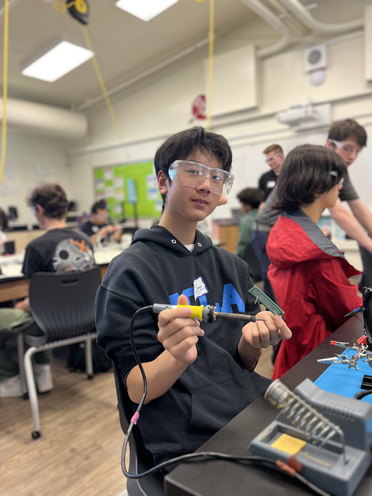
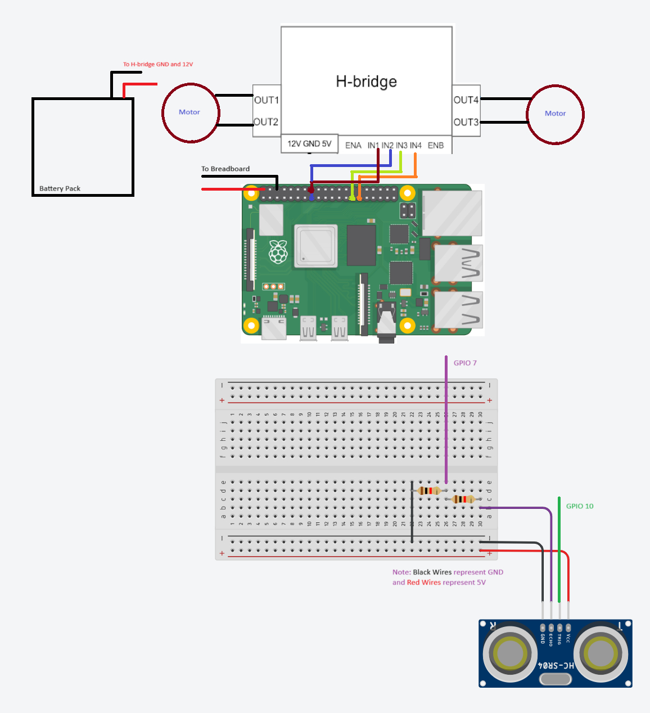

# Ball Tracker Robot
The Ball Tracker Robot is a self-driving robot that moves based on the objects it detects while following a red ball.


| **Engineer** | **School** | **Area of Interest** | **Grade** |
|:--:|:--:|:--:|:--:|
| Eric S | Lowell HS | Electrical Engineering | Incoming Sophomore

  
  
# Final Milestone
### Summary
For my final milestone, I completed the robot which allowed it to track a ball and follow it. Whenever the PiCamera detects a ball, the robot will move toward it unless the ball is too close. If the ball is towards the camera's right, the robot will turn until it faces the ball directly. Also, if the ball rolls out of view from the PiCamera, the robot will automatically turn in the direction the ball was last seen.

### Code
<details>
  <summary>Click to expand/collapse the Python code</summary>
  
```python
import time
import cv2
import numpy as np
from picamera2 import Picamera2
import RPi.GPIO as GPIO

lower_range = 213
upper_range = 426 

GPIO.setmode(GPIO.BCM)

motor1B = 6  # LEFT motor
motor1E = 5
motor2B = 22  # RIGHT motor
motor2E = 23

en_b = 24

GPIO.setup(motor1B, GPIO.OUT)
GPIO.setup(motor1E, GPIO.OUT)
GPIO.setup(motor2B, GPIO.OUT)
GPIO.setup(motor2E, GPIO.OUT)

GPIO.setup(en_a, GPIO.OUT)
GPIO.setup(en_b, GPIO.OUT)

power_a = GPIO.PWM(en_a, 180)
power_a.start(70)

power_b = GPIO.PWM(en_b, 180)
power_b.start(70)

def forward():
    GPIO.output(motor1B, GPIO.HIGH)
    GPIO.output(motor1E, GPIO.LOW)
    GPIO.output(motor2B, GPIO.HIGH)
    GPIO.output(motor2E, GPIO.LOW)

def reverse():
    GPIO.output(motor1B, GPIO.LOW)
    GPIO.output(motor1E, GPIO.HIGH)
    GPIO.output(motor2B, GPIO.LOW)
    GPIO.output(motor2E, GPIO.HIGH)

def leftturn():
    GPIO.output(motor1B, GPIO.LOW)
    GPIO.output(motor1E, GPIO.LOW)
    GPIO.output(motor2B, GPIO.HIGH)
    GPIO.output(motor2E, GPIO.LOW)

def rightturn():
    GPIO.output(motor1B, GPIO.HIGH)
    GPIO.output(motor1E, GPIO.LOW)
    GPIO.output(motor2B, GPIO.LOW)
    GPIO.output(motor2E, GPIO.LOW)

def stop():
    GPIO.output(motor1B, GPIO.LOW)
    GPIO.output(motor1E, GPIO.LOW)
    GPIO.output(motor2B, GPIO.LOW)
    GPIO.output(motor2E, GPIO.LOW)

def sharp_left():
    GPIO.output(motor1B, GPIO.LOW)
    GPIO.output(motor1E, GPIO.HIGH)
    GPIO.output(motor2B, GPIO.HIGH)
    GPIO.output(motor2E, GPIO.LOW)

def sharp_right():
    GPIO.output(motor1B, GPIO.HIGH)
    GPIO.output(motor1E, GPIO.LOW)
    GPIO.output(motor2B, GPIO.LOW)
    GPIO.output(motor2E, GPIO.HIGH)

def back_left():
    GPIO.output(motor1B, GPIO.LOW)
    GPIO.output(motor1E, GPIO.LOW)
    GPIO.output(motor2B, GPIO.LOW)
    GPIO.output(motor2E, GPIO.HIGH)

def back_right():
    GPIO.output(motor1B, GPIO.LOW)
    GPIO.output(motor1E, GPIO.HIGH)
    GPIO.output(motor2B, GPIO.LOW)
    GPIO.output(motor2E, GPIO.LOW)

picamera = Picamera2()
picamera.configure(picamera.create_preview_configuration(main={"size": (640, 480)}))
picamera.start()

colour = (0, 255, 0)
font = cv2.FONT_HERSHEY_SIMPLEX
origin = (50, 50)
scale = 1
thickness = 2

def apply_timestamp(frame):
    timestamp = time.strftime("%Y-%m-%d %X")
    cv2.putText(frame, timestamp, origin, font, scale, colour, thickness)

def detect_red_ball(frame):
    hsv = cv2.cvtColor(frame, cv2.COLOR_BGR2HSV)

    lower_red = np.array([150, 140, 1])
    upper_red = np.array([190, 255, 255])

    mask = cv2.inRange(hsv, lower_red, upper_red)

    mask = cv2.erode(mask, None, iterations=2)
    mask = cv2.dilate(mask, None, iterations=2)

    contours, _ = cv2.findContours(mask.copy(), cv2.RETR_EXTERNAL, cv2.CHAIN_APPROX_SIMPLE)

    center = None

    if len(contours) > 0:
        c = max(contours, key=cv2.contourArea)

        ((x, y), radius) = cv2.minEnclosingCircle(c)
        M = cv2.moments(c)
        center = (int(M["m10"] / M["m00"]), int(M["m01"] / M["m00"]))

        if radius > 10:
            cv2.circle(frame, (int(x), int(y)), int(radius), (255, 0, 0), 2) 
            cv2.putText(frame, "Red Ball", (int(x - radius), int(y - radius)), cv2.FONT_HERSHEY_SIMPLEX, 0.6, (255, 0, 0), 2)
            return frame, center, radius
    return frame, None, 0

close_threshold = 150

try:
    while True:
        frame = picamera.capture_array()
        frame = cv2.cvtColor(frame, cv2.COLOR_BGR2RGB)
        
        cv2.imshow('RGB Frame', frame)

        apply_timestamp(frame)

        frame, center, radius = detect_red_ball(frame)

        if center:
            if radius > close_threshold:
                print("Ball too close, stopping")
                stop()
            elif center[0] < lower_range:
                print("Ball on the left")
                leftturn()
                time.sleep(0.3)
                stop()
            elif center[0] > upper_range:
                print("Ball on the right")
                rightturn()
                time.sleep(0.3)
                stop()
            else:
                print("Ball centered, moving forward")
                forward()
                time.sleep(0.3)
                stop()
        else:
            print("Ball not detected, stopping")
            stop()

        cv2.imshow('Frame', frame)

        if cv2.waitKey(1) & 0xFF == ord('q'):
            break

except KeyboardInterrupt:
    print("Program interrupted by user")

finally:
    cv2.destroyAllWindows()
    picamera.close()
    GPIO.cleanup()
```

### Challenges
- I am unfamiliar with coding so this whole process was difficult
- My driver board wasn't getting enough power and it took a while for me to find the solution

### What's Next
- Begin my modifications
- Continue upgrading my portfolio by adding more details
  

# Second Milestone
<iframe width="560" height="315" src="https://www.youtube.com/embed/-geuLVvwCNM?si=ZdY8bKr4BySobwla&amp;start=1" title="YouTube video player" frameborder="0" allow="accelerometer; autoplay; clipboard-write; encrypted-media; gyroscope; picture-in-picture; web-share" referrerpolicy="strict-origin-when-cross-origin" allowfullscreen></iframe>
### Summary
For my second milestone, I wanted to set up the PiCamera to be able to not only detect a red ball but also put a green box around it. The program works exactly as it sounds. The PiCamera detects the ball by finding colors within a certain range and putting a box around it. Also, my code makes sure that only the largest object fitting those criteria is actually boxed, preventing other red objects from being focused on.

### Code
```
from picamera2 import Picamera2
import cv2
import time
import numpy as np

picam2 = Picamera2()

picam2.start()

time.sleep(2)

cv2.namedWindow('cheesecam', cv2.WINDOW_NORMAL)
lower_red = np.array([95, 150, 150])
upper_red = np.array([160, 255, 255])

while True:
    frame = picam2.capture_array()

    hsv = cv2.cvtColor(frame, cv2.COLOR_BGR2HSV)
    frame = cv2.cvtColor(frame, cv2.COLOR_BGR2RGB)

    mask = cv2.inRange(hsv, lower_red, upper_red)
    
    contours, _ = cv2.findContours(mask, cv2.RETR_EXTERNAL, cv2.CHAIN_APPROX_SIMPLE)
    
    if contours:
        largest_contour = max(contours, key=cv2.contourArea)
        x, y, w, h = cv2.boundingRect(largest_contour)
        cv2.rectangle(frame, (x, y), (x + w, y + h), (0, 255, 0), 2)
    
    cv2.imshow('cheesecam', frame)

    if cv2.waitKey(1) & 0xFF == ord('q'):
        break

picam2.stop()
cv2.destroyAllWindows()
```

### Challenges
- I had little experience in Python so writing the code was difficult
- I had to set up a lot of software in order to begin coding so that took a bit of time

### What's Next
I hope to begin my milestone 3 as soon as I can which is finishing the rest of the code and getting the robot to automatically detect the red ball and move towards it.

# First Milestone
<iframe width="560" height="315" src="https://www.youtube.com/embed/EjweVmvLvAc?si=SrWfulnb5zmT4sY9" title="YouTube video player" frameborder="0" allow="accelerometer; autoplay; clipboard-write; encrypted-media; gyroscope; picture-in-picture; web-share" referrerpolicy="strict-origin-when-cross-origin" allowfullscreen></iframe>

### Summary
For my first milestone, I have decided to finish setting up the hardware required to operate my robot. Essentially, the chassis, or the clear glass with wheels attached, strings together the other parts, allowing the robot to move. The Arduino and Raspberry Pi, both situated on top of the chassis, allow electricity to spread to other parts and receive code. Combined with the HC-SR04 sensors on the front, my robot will eventually be able to detect other objects and move accordingly.

### Materials Used
- Glass Chassis  Wheels (2 front 1 back)
- HC-SR04 Sensors + the corresponding glass parts
- Raspberry Pi Camera Module
- Raspberry Pi Module 4
- L298N Motor Driver
- Breadboard
- Motors x2
- Screws, nuts
- Female-to-female jumper wires
  
### Challenges
- The instructions for installing the glass chassis weren't super clear, especially with the installation of screws. The nuts for the screws wouldn't screw on because the glass chassis was in the way. However, this was solved by simply changing the direction the screws faced.
- I had absolutely no idea what to do due to the unclear instructions and inaccurate wiring schematics so I had to figure out a lot of things on my own, which took a bit of time.
- There were a lot of wires to deal with since each sensor (x3) had a total of four wires, so my robot looked extremely messy. I solved this issue by rearranging the position of wires and replacing longer wires with shorter wires.

### What's Next
In the future, I hope to continue my code and tidy up my robot further.

## Hardware Schematic
  

  - Left Trig (GPIO 16), Left Echo (GPIO 9)
  - Center Trig (GPIO 26), Center Echo (GPIO 11)
  - NOTE: The resistors used are 570 ohms.


# Starter Project
<iframe width="560" height="315" src="https://www.youtube.com/embed/NTk1sGW9OV4?si=3lOBwtOGQsa74cHu" title="YouTube video player" frameborder="0" allow="accelerometer; autoplay; clipboard-write; encrypted-media; gyroscope; picture-in-picture; web-share" allowfullscreen></iframe>

My starter project is the Weevil Eyes, which is a light-detecting bug that glows depending on the surrounding light. If the environment is dark, then the lights glow up. For this project, there weren't any big challenges due to the lack of coding and complex steps. Essentially, the bug works by sensing the surrounding light with a sensor at the bottom. If there is light, that signal will go towards the transistor, which is like a switch. When there is light, the transistor will make sure that the LEDs do not light up. However, if there isn't light, the transistor will send electricity to the resistors, which resist electricity to ensure that the LEDs are not fried. And as electricity goes through the resistors and towards the LEDs, the LEDs then illuminate.

<!--- # Schematics 

# Code Used

```c++
void setup() {
  // put your setup code here, to run once:
  Serial.begin(9600);
  Serial.println("Hello World!");
}

void loop() {
  // put your main code here, to run repeatedly:

}
```
-->
# Materials Used

| **Part** | **Note** | **Price** | **Link** |
|:--:|:--:|:--:|:--:|
| Basic Connections Component Kit      | Connects parts to other parts                       | $11.99 | [Link](https://www.amazon.com/Smraza-Breadboard-Resistors-Mega2560-Raspberry/dp/B01HRR7EBG/ref=sr_1_16?crid=27G99F3EADUCG&keywords=breadboard+1+pc&qid=1689894556&sprefix=breadboard+1+p%2Caps%2C185&sr=8-16)    |
| Battery Pack | Supplies energy to the Driver Board | $5.98 | [Link](https://www.amazon.com/LAMPVPATH-Battery-Holder-Leads-Wires/dp/B07T7MTRZX/ref=sr_1_21?dib=eyJ2IjoiMSJ9.iF-VDq6PgDSgOxmlvHs3LNeO-wB2es1OhQzIPrXKMfl439GnaWRVrZ6jInQu0P-rzOjgqC4Ogi657o4Wyk5432Mb4qD6PGYAIOixRjRjoiwLZcA40wdk-bTe83zQcegxujz3UW8FpsAwBZ_Ur1QYqxjXUqzHylbFNSAHBdEHP-29p0eap_H0UbTB5eIDRCZRH5FrJuzeoFSQtSAUaYb9HNWUNEAXFuGQG1nfHLCQsXk3KvxMDWTPAPCcstFWZ4CSEOdhC1WBI2GPKpeq9YvWAHs_4dC-uLzzrRP-_6FafEE.DxfQnHmdzWIgHSejfTpH45G0rpLSY8okQItQUvW2_X0&dib_tag=se&keywords=4+double+aa+battery+pack&qid=1719854922&sr=8-21) |
| Female to Female Jumper Wires        | Used to connect parts to others                 | $7.98  | [Link](https://www.amazon.com/EDGELEC-Breadboard-1pin-1pin-Connector-Multicolored/dp/B07GCY6CH7/ref=sr_1_3?crid=3C4YB6HOGZ8ZQ&keywords=female%2Bto%2Bfemale%2Bjumper&qid=1689894791&s=electronics&sprefix=female%2Bto%2Bfemale%2Bjumper%2Celectronics%2C161&sr=1-3&th=1) |
| HC-SR04 Sensors                       | Allows the robot to see obstacles                | $8.99  | [Link](https://www.amazon.com/Organizer-Ultrasonic-Distance-MEGA2560-ElecRight/dp/B07RGB4W8V/ref=sr_1_2?crid=UYI359LWAAVU&keywords=hc%2Bsr04%2Bultrasonic%2Bsensor%2B3%2Bpc&qid=1689699122&s=electronics&sprefix=hc%2Bsr04%2Bultrasonic%2Bsensor%2B3%2Bpc%2Celectronics%2C123&sr=1-2&th=1) |
| HDMI to Micro HDMI Cable             | Connects pi to the monitor                      | $8.99  | [Link](https://www.amazon.com/UGREEN-Adapter-Ethernet-Compatible-Raspberry/dp/B06WWQ7KLV/ref=sr_1_5?crid=3S06RDX7B1X4O&keywords=hdmi+to+micro+hdmi&qid=1689699482&s=electronics&sprefix=hdmi+to+micro%2Celectronics%2C132&sr=1-5)        |
| L298N Driver Board                   | Drives the wheels forward and backwards          | $8.99  | [Link](https://www.amazon.com/Qunqi-2Packs-Controller-Stepper-Arduino/dp/B01M29YK5U/ref=sr_1_1_sspa?crid=3DE9ZH0NI3KJX&keywords=l298n&qid=1689698859&s=electronics&sprefix=l298n%2Celectronics%2C164&sr=1-1-spons&sp_csd=d2lkZ2V0TmFtZT1zcF9hdGY&psc=1)           |
| Motors and Board Kit                 | Holds the hardware together like a frame         | $12.99 | [Link](https://www.amazon.com/Smart-Chassis-Motors-Encoder-Battery/dp/B01LXY7CM3/ref=sr_1_4?crid=27ACD61NPNLO4&keywords=robot+car+kit&qid=1689698962&s=electronics&sprefix=robot+car+kit%2Celectronics%2C169&sr=1-4)                 |
| Raspberry Pi 4 Model B               | Used to control the robot and to write code     | $61.75 | [Link](https://www.amazon.com/Raspberry-Model-2019-Quad-Bluetooth/dp/B07TC2BK1X/ref=sr_1_1?dib=eyJ2IjoiMSJ9.mP4drOfyakW9P2E6ytjWi6qbtB-JQDqa2RakmAyNa9uFk6zyVo26t34g79h8WnJt-j5NFtZiPMwW_fxSCMiOU712GisNPz2Ia9-reRDlIXM9GzgCWAUjjjLXte9O76t7LMfvjwpxIGzwzp8ECyhKZDA0nC48kKhMOMztnXd0Z5koYi7knLmWqVtqnd40j3HPijqhM4nERHibIEH5lK80lVq68d19Xs98CAKVvA41TQ0.f2mafwXZh9DmMScBCo1eF23-W-0MoDJc3s9GKbZpw_I&dib_tag=se&keywords=raspberry%2Bpi%2Bmodel%2B4&qid=1718296643&sr=8-1&th=1) |
| Raspberry Pi Camera Module           | Video capture                                    | $14.99 | [Link](https://www.amazon.com/Arducam-Autofocus-Raspberry-Motorized-Software/dp/B07SN8GYGD/ref=sr_1_5?crid=3236VFT39VAPQ&keywords=picamera&qid=1689698732&s=electronics&sprefix=picamer%2Celectronics%2C138&sr=1-5)                |
| SD Card Reader                       | Stores data                       | $4.99  | [Link](https://www.amazon.com/Reader-Adapter-Camera-Memory-Wansurs/dp/B0B9QZ4W4Y/ref=sr_1_4?crid=F124KSQOC5SO&keywords=sd+card+reader&qid=1689869007&sprefix=sd+card+reader%2Caps%2C126&sr=8-4)                                    |
| Soldering Kit                        | Used for motor connections                      | $14.99 | [Link](https://www.amazon.com/Soldering-Interchangeable-Adjustable-Temperature-Enthusiast/dp/B087767KNW/ref=sr_1_5?crid=1QYWI5SBQAPH0&keywords=soldering+kit&qid=1689900771&sprefix=soldering+kit%2Caps%2C169&sr=8-5)            |
| Video Capture Card                   | Allows for display on laptops                   | $14.99 | [Link](https://www.amazon.com/Capture-Streaming-Broadcasting-Conference-Teaching/dp/B09FLN63B3/ref=sr_1_3?crid=19YSORXLTIALH&keywords=video+capture+card&qid=1689699799&s=electronics&sprefix=video+capture+car%2Celectronics%2C140&sr=1-3) |
| Wireless Mouse and Keyboard          | Used to operate Rasp pi                         | $19.98 | [Link](https://www.amazon.com/Wireless-Keyboard-Trueque-Cordless-Computer/dp/B09J4RQFK7/ref=sr_1_1_sspa?crid=2R048HRMFBA7Z&keywords=mouse+and+keyboard+wireless&qid=1689871090&sprefix=mouse+and+keyboard+wireless+%2Caps%2C131&sr=8-1-spons&sp_csd=d2lkZ2V0TmFtZT1zcF9hdGY&psc=1)   |
